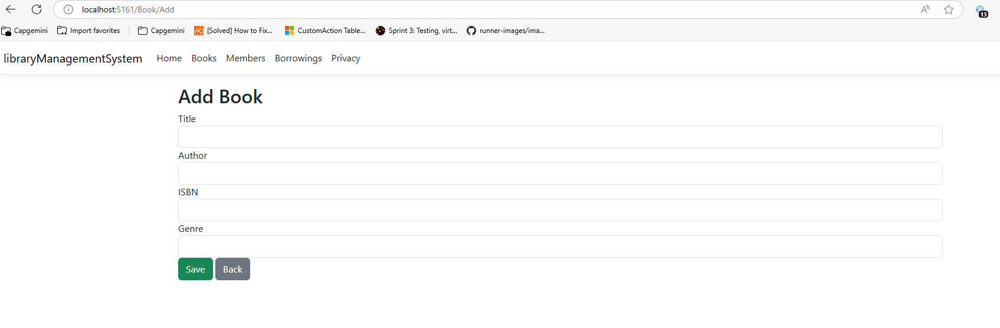
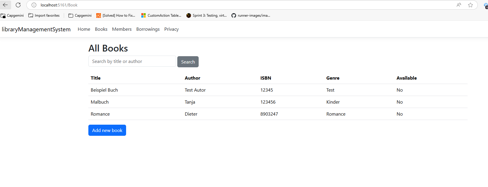
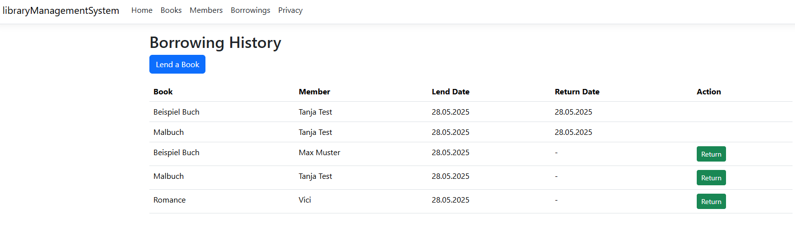
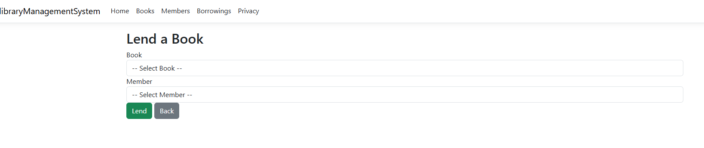
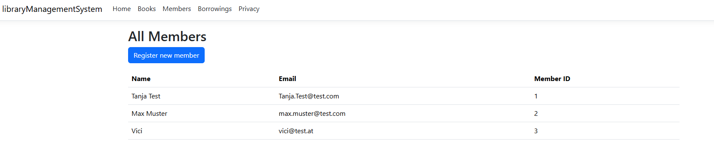
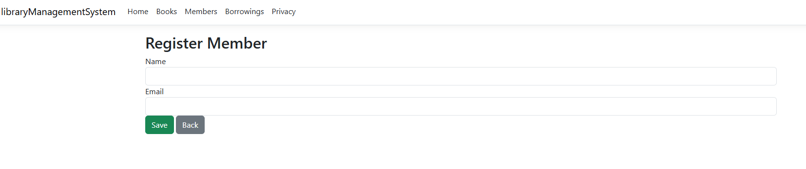

# Library Management System

A web-based library management system built with ASP.NET Core MVC, Entity Framework Core, and SQLite.

## Project Overview
This application allows you to manage books, members, and lending operations for a library. Data is stored in JSON, XML, and flat files. The system features:
- **Book Management**: Add, search, and list books
- **Member Management**: Register and list members
- **Lending System**: Lend and return books, view lending history
- **Data Storage**: Books (JSON), Members (XML), Borrow Records (flat file)
- **Logging**: All lending/return actions are logged to `Data/logs.txt`

## Installation Guide
1. **Install .NET 9 SDK** (or the version specified in `libraryManagementSystem.csproj`)
2. **Clone the repository**
3. **Restore dependencies**:
   ```powershell
   dotnet restore
   ```
4. **Build the project**:
   ```powershell
   dotnet build
   ```
5. **Run the application**:
   ```powershell
   dotnet run
   ```
6. **Access the app**: Open your browser at the URL shown in the console (e.g., http://localhost:5161)

## Screenshots
- 
- 
- 
- 
- 
- 

## Example GitHub Copilot Prompts Used
- "Build a web-based library management system using ASP.NET Core MVC and Entity Framework Core with SQLite."
- "Add robust null checks or strongly-typed view models to Borrow/Index.cshtml to prevent runtime errors."
- "Implement logging for all lend and return actions to logs.txt."
- "Write modular xUnit test classes for BookService, MemberService, BorrowService, DataSeeder, and integration tests."
- "Update .csproj to copy Data/ files to output directory for tests."

## Development Challenges
- **Null Reference Handling**: Ensuring all dynamic view models and data loading logic are robust against missing or inconsistent data.
- **File-Based Data Storage**: Coordinating JSON, XML, and flat file access and updates, especially for concurrent operations and testability.
- **Test Data Availability**: Ensuring test data files are always available in the test output directory for reliable automated testing.
- **Integration of Logging**: Implementing runtime logging for all lending/return actions in a way that is robust and does not impact performance.
- **Localization**: Ensuring the UI is consistently in English and navigation is user-friendly.

---

**Note:** This project is a functional prototype and can be extended with features like editing/deleting books/members, advanced validation, and improved UI/UX.
